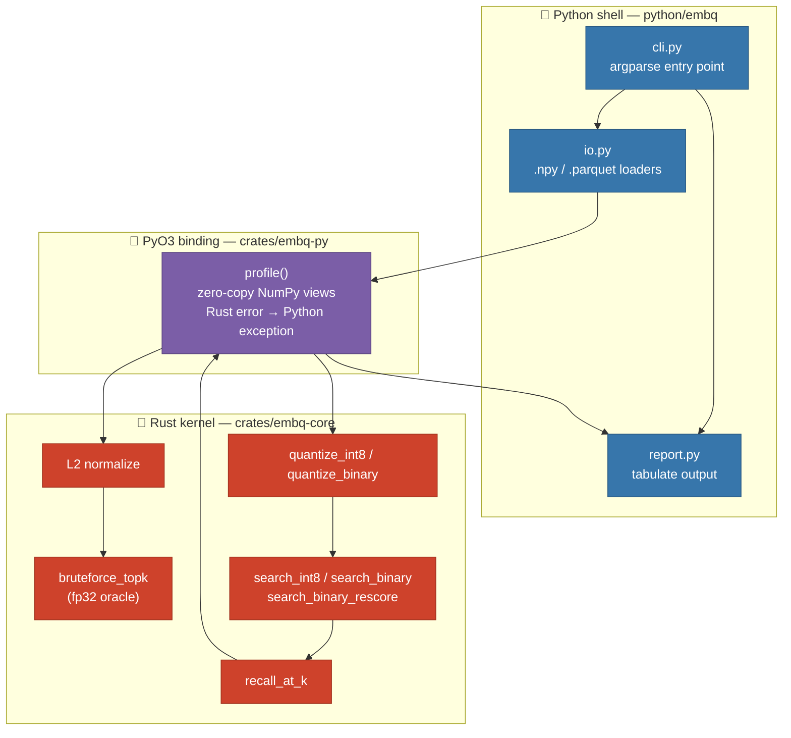

# embq

**Quantization trade-off profiler for embeddings.** Measure *recall × compression × latency* for `fp32`, `int8`, `binary`, and `binary+rescore` on **your own data**, before you commit to a vector index in production.

[](https://github.com/mjlelis/embq/actions/workflows/ci.yml)
[](#license)

---

## Why this exists

Embedding databases are dominated by one cost: **storing and scanning float32 vectors**. A 1M × 1024-dim index is ~4 GB. Quantization shrinks that dramatically — `int8` is 4× smaller, `binary` is 32× smaller — but every bit you drop costs recall.

The catch: *how much* recall you lose depends entirely on **your** embeddings. A model whose vectors are well-spread tolerates binary quantization beautifully; a model with tightly-clustered vectors falls apart. There is no universal answer, only your data.

`embq` answers the question empirically. Point it at your embeddings and it reports the exact trade-off, so you can pick the smallest representation that still meets your recall target.

## What it measures

| Method | Description | Bits/dim | Typical use |
| :--- | :--- | :--- | :--- |
| `fp32` | Exact brute-force search — the **ground-truth oracle** | 32 | Baseline / recall reference |
| `int8` | Symmetric quantization to 8-bit integers | 8 | Near-lossless, 4× smaller |
| `binary` | 1-bit sign quantization, Hamming-distance search | 1 | Aggressive, 32× smaller |
| `binary+rescore` | Binary shortlist, then re-rank the top `k × oversample` with fp32 | 1 (+fp32 rerank) | Best of both: 32× storage, high recall |

`recall@k` is computed against the fp32 brute-force result, which is exact by construction.

## Architecture

`embq` is a thin Python shell over a dependency-free Rust kernel, bridged by PyO3. The heavy numeric loops never leave Rust.



**Design rationale** (see [`doc/arquitetura.md`](doc/arquitetura.md) for the full write-up):

- **Rust kernel (`embq-core`)** — pure Rust, no Python at all. Row-major contiguous layouts for cache locality; simple loops written so LLVM can autovectorize (AVX2/AVX-512) without hand-written intrinsics. Memory safety matters most in the bit-packing path, where binary vectors are packed into `u64` words.
- **PyO3 binding (`embq-py`)** — a thin bridge. NumPy buffers are read in place where possible to avoid copies; Rust `thiserror` errors are converted into friendly Python exceptions.
- **Python shell (`python/embq`)** — ergonomics only: I/O for the industry-standard `.npy` and `.parquet` formats, a CLI, and readable reports. Iterate on `k` / `oversample` without recompiling.

## Installation

Requires a Rust toolchain (stable) and Python ≥ 3.9.

```bash
git clone https://github.com/mjlelis/embq.git
cd embq

pip install maturin
maturin develop --release   # compiles the Rust kernel and installs the embq package
```

## Usage

### Python API

```python
import numpy as np
from embq import profile

embeddings = np.random.randn(2000, 256).astype(np.float32)

report = profile(embeddings, k=10)
for r in report.results:
    print(f"{r.method:16s} recall@10={r.recall_at_k:.4f}  {r.compression_ratio:.0f}x smaller")
```

`profile()` parameters: `embeddings`, optional `queries` (defaults to sampling 100 rows from the set), `k`, `methods` (subset of the four above), and `oversample` (candidate multiplier for `binary+rescore`).

### CLI

```bash
embq run --embeddings data.npy --k 10
embq run --embeddings data.parquet --queries queries.npy --k 10 --oversample 20
```

## Demo results

Reproducible via [`examples/leaderboard/run.py`](examples/leaderboard/run.py) — 2,000 vectors, 256 dims, 50 clusters, seed 0:

```bash
python examples/leaderboard/run.py
```

| Method | Recall@10 | Bytes/vec | Compression |
| :--- | ---: | ---: | ---: |
| `int8` | 0.8120 | 256 B | 4.0× |
| `binary` | 0.4100 | 32 B | 32.0× |
| `binary+rescore` | **1.0000** | 32 B | **32.0×** |

The takeaway on this dataset: raw `binary` loses more than half its recall, but adding a cheap fp32 re-rank over the binary shortlist recovers it **completely at 32× compression** — strictly better than `int8` on both axes here. On *your* data the numbers will differ, which is exactly the point of measuring. (Latency is reported per query but omitted here as it is machine-dependent.)

## How recall is computed

1. All vectors are **L2-normalized**, so cosine similarity reduces to a dot product.
2. `fp32` brute-force produces the exact top-`k` for each query — the **oracle**.
3. Each quantized method produces its own top-`k`.
4. `recall@k` = average over queries of `|predicted ∩ truth| / k`.

`binary+rescore` is the interesting one: it retrieves `k × oversample` candidates cheaply by Hamming distance over packed bits, then re-scores only those candidates with exact fp32 dot products — paying full precision on a tiny shortlist instead of the whole database.

## Project layout

```
crates/
  embq-core/     Rust kernel: quantization, search, recall (no Python deps)
    tests/       correctness tests (oracle + recall sanity)
  embq-py/       PyO3 bindings exposing profile()
python/embq/     CLI, I/O loaders, report formatting
tests/           pytest suite (API, I/O, CLI)
examples/        reproducible demo
doc/             architecture and technical notes (Portuguese)
```

## Development

```bash
# Rust
cargo fmt --all -- --check
cargo clippy --workspace --all-targets -- -D warnings
cargo test --workspace

# Python (after `maturin develop`)
pip install pytest
pytest -q
```

CI runs all of the above on Linux/Windows/macOS and builds wheels for each platform.

## License

Licensed under either of:

- Apache License, Version 2.0 ([LICENSE-APACHE](LICENSE-APACHE) or <http://www.apache.org/licenses/LICENSE-2.0>)
- MIT license ([LICENSE-MIT](LICENSE-MIT) or <http://opensource.org/licenses/MIT>)

at your option.
